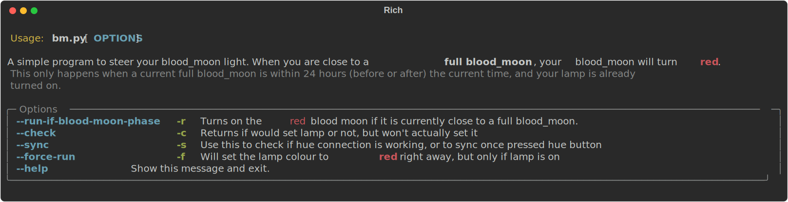

# Blood Moon



## Description
Blood Moon is a small CLI to steer a moon-themed lamp (Philips Hue). It automatically adjusts the lamp color based on lunar phases:
- Near a full moon (within 24 hours), the lamp turns red.
- Near a new moon (within 24 hours), the lamp turns teal.

The lamp color is only changed if the lamp is already turned on.

## Features
- Detects the closest full moon and new moon using PyEphem.
- Scheduled run mode that sets:
  - red within 24h of a full moon;
  - teal within 24h of a new moon.
- Check mode to see what would happen right now without changing the lamp.
- Force modes to immediately set red or teal (if the lamp is on).
- Sync utility to verify/register Hue bridge connectivity.
- Rich, colorized CLI help (see help.svg at the top).

## Requirements
- Python 3.14+
- Recommended: uv for environment and command execution.

All project dependencies are declared in [pyproject.toml](pyproject.toml).

## Installation
1. Clone the repository:
   ```bash
   git clone <repository-url>
   cd blood_moon
   ```
2. Install dependencies with uv:
   ```bash
   uv sync
   ```
3. Configure environment:
   Create a `.env` file and set your Hue bridge IP and lamp name:
   ```properties
   HUE_BRIDGE_IP=your-hue-bridge-ip
   MOON_LAMP_NAME=Your Lamp Name
   ```

## Usage
There are two ways to run Blood Moon:

- Use the console wrapper (runs the scheduled action):
  ```bash
  uv run blood_moon
  ```
  This executes the scheduled mode (turns red near full moon, teal near new moon).

- Use the CLI directly for full control:
  - Check what would happen right now (no changes):
    ```bash
    uv run python blood_moon/bm.py --check
    ```
  - Run the scheduled action explicitly:
    ```bash
    uv run python blood_moon/bm.py --run-if-moon-phase
    ```
  - Force red (if lamp is on):
    ```bash
    uv run python blood_moon/bm.py --force-red
    ```
  - Force teal (if lamp is on):
    ```bash
    uv run python blood_moon/bm.py --force-teal
    ```
  - Sync/verify Hue connectivity (press the bridge link button if prompted):
    ```bash
    uv run python blood_moon/bm.py --sync
    ```

## Testing
Run the full build pipeline (format, lint, slotscheck, tests with coverage):
```bash
uv run build
```
Or run tests only:
```bash
uv run pytest --cov=blood_moon -q
```

## Regenerate the CLI help SVG
The top image (help.svg) is generated from the CLI help output. To regenerate it:
```bash
uv run help_svg
```

## Systemd (optional)
Example unit files are provided under `systemd/`. The service runs the scheduled action via the console wrapper:
```ini
ExecStart=/usr/bin/uv run blood_moon
```
Adjust `WorkingDirectory` and environment to fit your setup.
